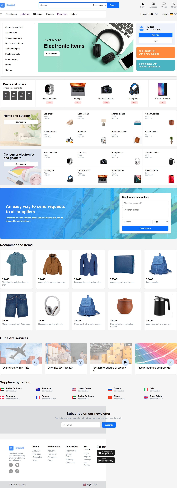
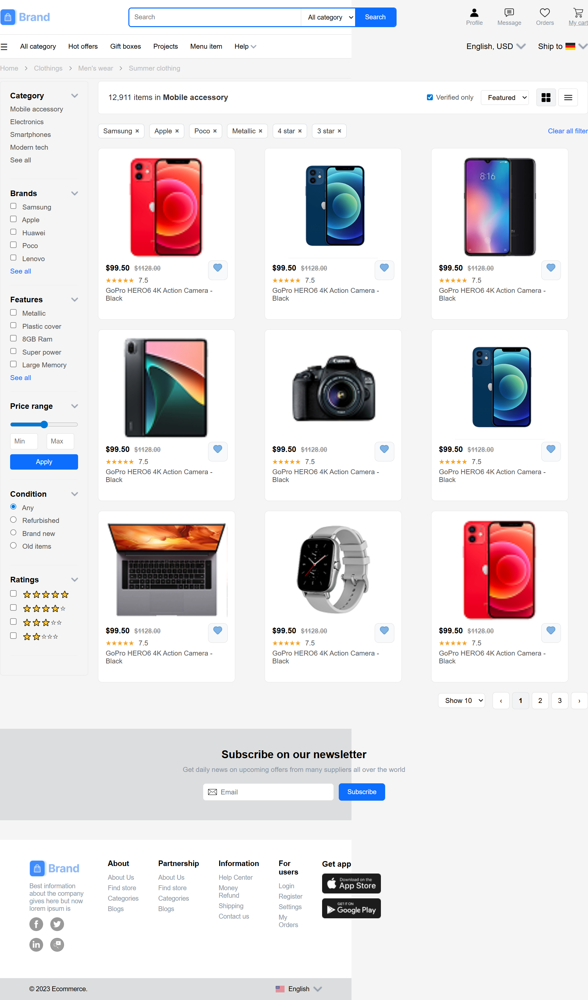
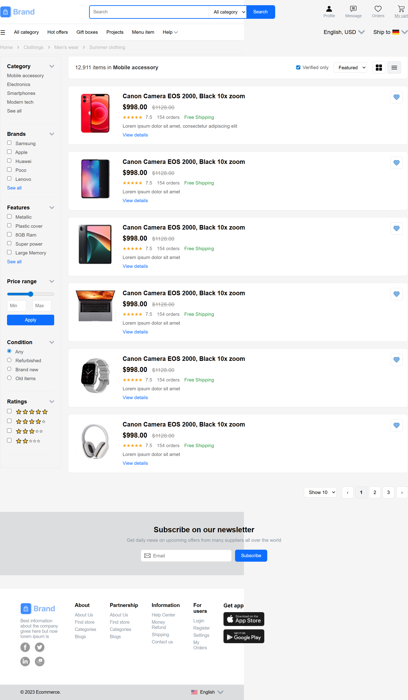
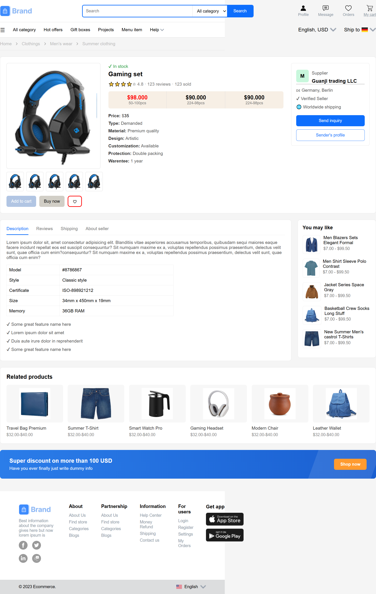
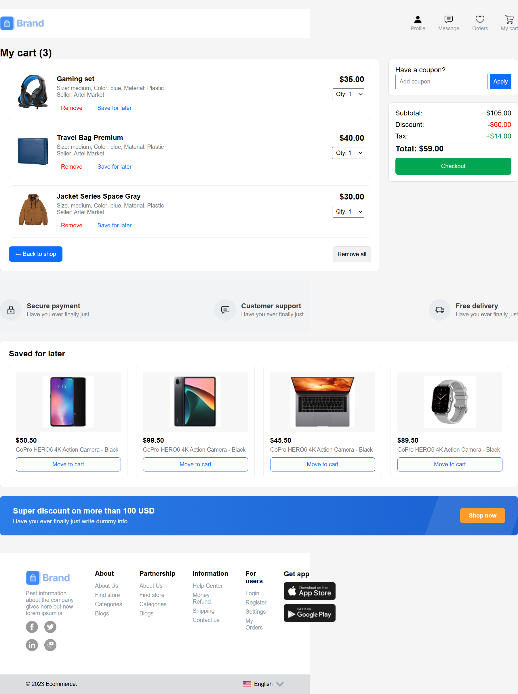

# 🛒 E-Commerce Website

A responsive front-end eCommerce website built using **HTML, CSS, and JavaScript**.
This project includes product listing, product details, category filtering, and cart functionality using localStorage.

---

## 🚀 Features

* 🏠 Homepage with categories and offers
* 🛍️ Products Grid View
* 📋 Products List View
* 📦 Dynamic Product Details Page
* 🛒 Add to Cart (localStorage)
* 🔄 Dynamic product switching (no reload)
* 📱 Responsive Design

---

## 🧠 How it Works

* Clicking a product saves data in **localStorage**
* Product details page loads that data dynamically
* Suggested and related products update the page instantly

---

## 🛠️ Technologies Used

* HTML5
* CSS3
* JavaScript (Vanilla JS)
* LocalStorage

---

## 📸 Screenshots

### 🏠 Homepage



### 🛍️ Products Grid



### 📋 Products List



### 📦 Product Details



### 🛒 Cart



---

## 📂 Project Structure

```
project/
│── index.html
│── products-grid.html
│── products-list.html
│── products-details.html
│── cart.html
│
├── css/
├── js/
├── assets/
└── screenshots/
```
## 🌐 Live Demo
https://timely-scone-69599b.netlify.app/

## ⭐ Notes

This project was created as part of an internship evaluation task.
